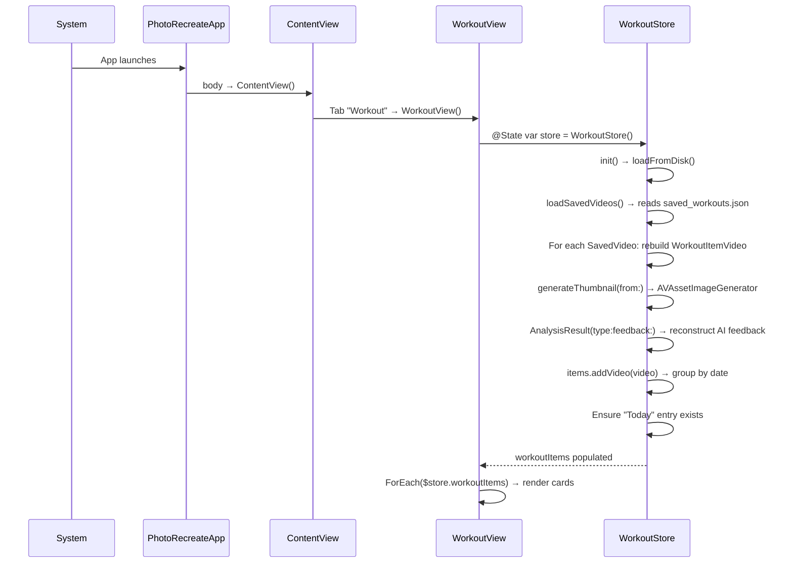
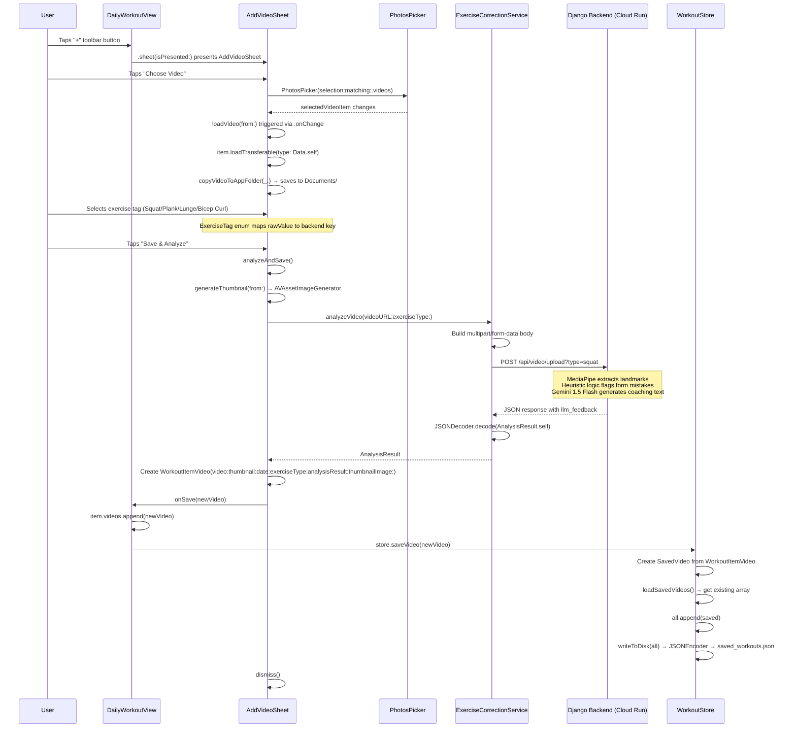
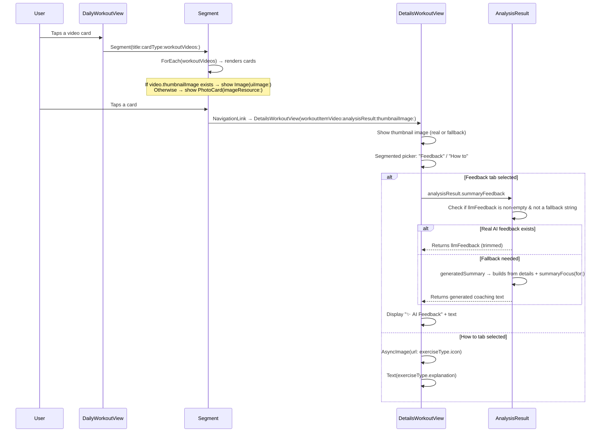
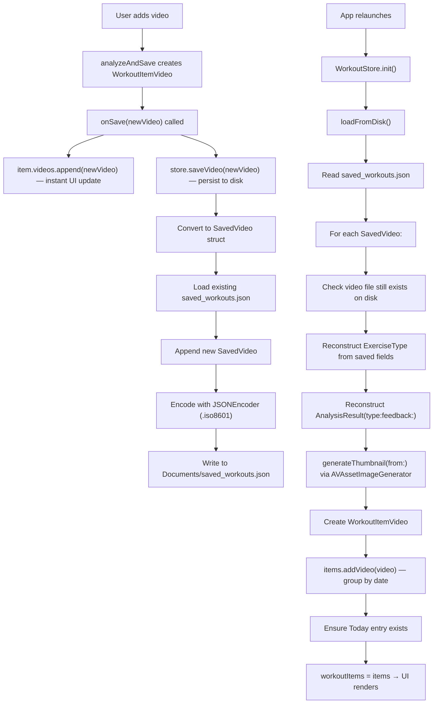
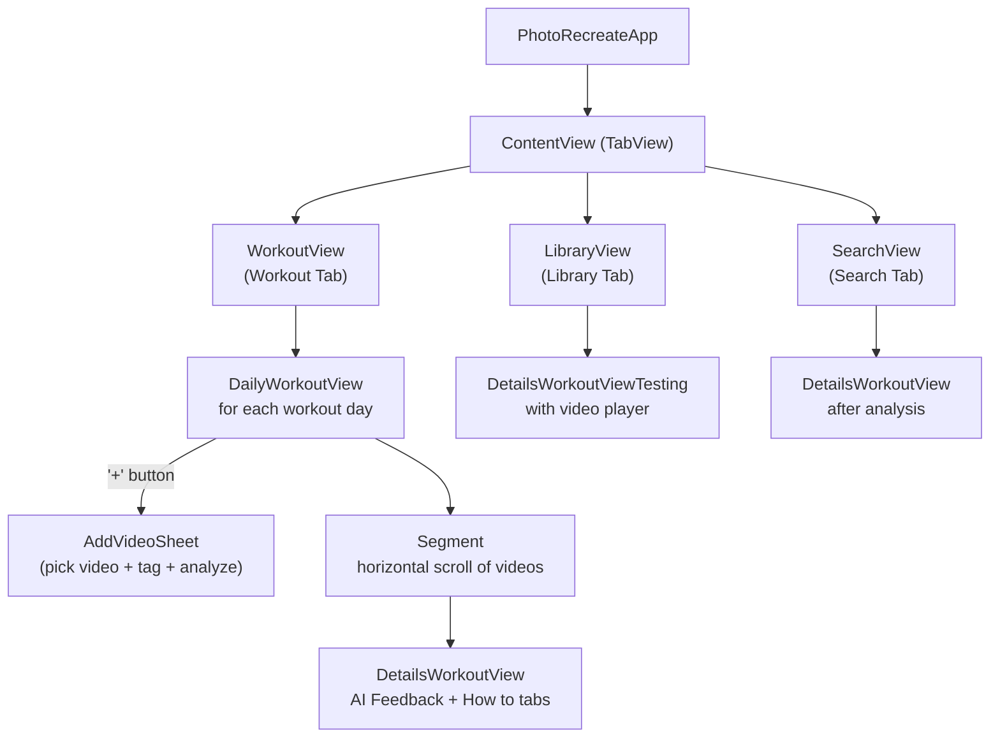

# PhotoRecreate — Complete Codebase Workflow

> AI-powered fitness coaching iOS app. Users upload workout videos, the backend analyzes form using MediaPipe + Gemini AI, and the app displays personalized coaching feedback.

---

## Project Structure

```
PhotoRecreate/
├── PhotoRecreateApp.swift              ← App entry point
├── Models/
│   ├── WorkoutModel.swift              ← WorkoutItem, WorkoutItemVideo, ExerciseType
│   ├── ExerciseAnalysisModel.swift     ← AnalysisResult, FeedbackDetail, MotionData
│   └── Analysis/
│       ├── FeedbackModel.swift         ← Simple feedback struct
│       ├── MotionHistory.swift         ← Motion data point struct
│       └── WorkoutAnalysisModel.swift  ← ExerciseAnalysis struct
├── Services/
│   ├── ExerciseCorrectionService.swift ← Backend API client (video upload)
│   └── WorkoutStore.swift             ← Data persistence (JSON file storage)
├── View/
│   ├── ContentView.swift              ← TabView (Workout / Library / Search)
│   ├── Workout/WorkoutView.swift      ← Main workout list screen
│   ├── Collections/
│   │   ├── DailyWorkoutView.swift     ← Videos for one workout day + Add Video sheet
│   │   └── Collections.swift          ← Collections browsing view
│   ├── DetailsWorkout/
│   │   ├── DetailsWorkoutView.swift   ← Video detail with AI Feedback + How-to tabs
│   │   └── DetailsWorkoutViewTesting.swift ← Testing variant with video player
│   ├── Library/LibraryView.swift      ← Grid of all workout videos
│   └── SearchView.swift              ← Standalone analysis screen
├── Component/
│   ├── Segment.swift                  ← Horizontal scrolling video cards
│   ├── PhotoCard.swift                ← Photo card with title overlay
│   ├── PhotoCardWithoutTitle.swift    ← Photo card (no title)
│   ├── LoveButton.swift               ← Favourite button
│   └── Workout/WorkoutCardComponent.swift ← Workout day card
└── Components/
    ├── PhotoCards.swift               ← Photo card collection
    └── ToolBar.swift                  ← Toolbar component
```

---

## Flow 1: App Launch & Data Loading



### Functions involved:
| Function | File | Purpose |
|---|---|---|
| `PhotoRecreateApp.body` | `PhotoRecreateApp.swift` | Entry point, creates `ContentView()` |
| `ContentView.body` | `ContentView.swift` | TabView with 3 tabs: Workout, Library, Search |
| `WorkoutStore.init()` | `WorkoutStore.swift` | Calls `loadFromDisk()` |
| `WorkoutStore.loadFromDisk()` | `WorkoutStore.swift` | Reads JSON, rebuilds `[WorkoutItem]` from saved data |
| `WorkoutStore.loadSavedVideos()` | `WorkoutStore.swift` | Decodes `[SavedVideo]` from `saved_workouts.json` using `JSONDecoder` with `.iso8601` date strategy |
| `WorkoutStore.generateThumbnail(from:)` | `WorkoutStore.swift` | Uses `AVAssetImageGenerator.copyCGImage(at:actualTime:)` to grab video frame at 0.5s |
| `AnalysisResult.init(type:feedback:)` | `ExerciseAnalysisModel.swift` | Convenience init to recreate minimal AnalysisResult from saved `llmFeedback` string |
| `Array<WorkoutItem>.addVideo(_:)` | `WorkoutModel.swift` | Groups video into existing day or creates new `WorkoutItem` |
| `Date.formattedWorkoutDate` | `WorkoutModel.swift` | Returns "Today", "Yesterday", or "d MMM" |

---

## Flow 2: Adding a Video & Getting AI Analysis

This is the main feature flow. User taps "+" in DailyWorkoutView.



### Functions involved:
| Function | File | Purpose |
|---|---|---|
| `DailyWorkoutView.body` | `DailyWorkoutView.swift` | Shows grouped videos + "+" toolbar button |
| `DailyWorkoutView.groupedVideos` | `DailyWorkoutView.swift` | `Dictionary(grouping:by:)` — groups videos by exercise name |
| `AddVideoSheet.body` | `DailyWorkoutView.swift` | UI: PhotosPicker + ExerciseTag picker + "Save & Analyze" button |
| `AddVideoSheet.loadVideo(from:)` | `DailyWorkoutView.swift` | `@MainActor async` — loads video data from `PhotosPickerItem`, calls `copyVideoToAppFolder` |
| `AddVideoSheet.copyVideoToAppFolder(_:)` | `DailyWorkoutView.swift` | Writes video `Data` to `Documents/workout-{UUID}.mp4` |
| `AddVideoSheet.analyzeAndSave()` | `DailyWorkoutView.swift` | `@MainActor` — orchestrates thumbnail generation, API call, and save |
| `AddVideoSheet.generateThumbnail(from:)` | `DailyWorkoutView.swift` | `AVAssetImageGenerator` → grabs frame at 0.5s → returns `UIImage?` |
| `ExerciseTag.rawValue` | `DailyWorkoutView.swift` | Maps enum to backend key: `.squat` → `"squat"`, `.bicepCurl` → `"bicep_curl"` |
| `ExerciseTag.exerciseType` | `DailyWorkoutView.swift` | Creates `ExerciseType` with name, icon URL, and explanation text |
| `ExerciseCorrectionService.analyzeVideo(videoURL:exerciseType:)` | `ExerciseCorrectionService.swift` | Builds multipart POST, uploads to Cloud Run, decodes JSON response |
| `WorkoutStore.saveVideo(_:)` | `WorkoutStore.swift` | Converts `WorkoutItemVideo` → `SavedVideo`, appends to JSON file |
| `WorkoutStore.writeToDisk(_:)` | `WorkoutStore.swift` | `JSONEncoder` with `.iso8601` → writes to `saved_workouts.json` |

---

## Flow 3: Viewing AI Feedback (Detail View)

User taps a video card to see the analysis result.



### Functions involved:
| Function | File | Purpose |
|---|---|---|
| `Segment.body` | `Segment.swift` | Horizontal scroll of video cards with NavigationLinks |
| `DetailsWorkoutView.body` | `DetailsWorkoutView.swift` | Two-tab view: AI Feedback + How to |
| `AnalysisResult.summaryFeedback` | `ExerciseAnalysisModel.swift` | Returns `llmFeedback` if valid, or falls back to `generatedSummary` |
| `AnalysisResult.generatedSummary` | `ExerciseAnalysisModel.swift` | Builds human-readable summary from `details` array using `summaryFocus(for:exerciseName:)` |
| `AnalysisResult.summaryFocus(for:exerciseName:)` | `ExerciseAnalysisModel.swift` | Switch on stage name → returns specific coaching advice per issue type |
| `AnalysisResult.fallbackSummaryStrings` | `ExerciseAnalysisModel.swift` | Set of generic strings to detect and replace with generated text |
| `AnalysisResult.resolvedMistakeCount` | `ExerciseAnalysisModel.swift` | `mistakeCount ?? details.count` |
| `String.humanizedStageTitle` | `ExerciseAnalysisModel.swift` | `"knee_too_tight"` → `"Knee Too Tight"` |

---

## Flow 4: Data Persistence (Save & Reload)



### What gets saved (SavedVideo struct):
```swift
struct SavedVideo: Codable {
    let videoFileName: String       // "workout-ABC123.mp4"
    let exerciseName: String        // "Squat"
    let exerciseIconURL: String     // Unsplash URL
    let exerciseExplanation: String // How-to text
    let date: Date                  // ISO 8601
    let llmFeedback: String?        // AI coaching text
    let analysisType: String?       // "squat"
}
```

### What gets regenerated on load:
- **Thumbnail** → `generateThumbnail(from:)` grabs frame from video file
- **AnalysisResult** → `AnalysisResult(type:feedback:)` convenience init
- **ExerciseType** → reconstructed from saved name, icon URL, and explanation

---

## Backend API

### Endpoint
```
POST https://exercise-correction-847512274646.asia-southeast2.run.app/api/video/upload?type={exerciseType}
```

### Supported exercise types
| Tag | Backend key | 
|---|---|
| Squat | `squat` |
| Plank | `plank` |
| Lunge | `lunge` |
| Bicep Curl | `bicep_curl` |

### Request
- **Method:** POST
- **Content-Type:** `multipart/form-data`
- **Body:** Video file as `file` field
- **Timeout:** 180 seconds (set in `ExerciseCorrectionService`)

### Response JSON
```json
{
  "type": "squat",
  "processed": true,
  "file_name": "video_20260427.mp4",
  "mistake_count": 3,
  "details": [
    {
      "stage": "knee_too_tight",
      "timestamp": 2,
      "explanation": "Your knees tracked too far inside...",
      "frame": "http://.../static/images/frame_123.jpg"
    }
  ],
  "llm_feedback": "Your squat set shows a great baseline of strength...",
  "motion_history": [...],
  "counter": { "single": 5 }
}
```

### Backend pipeline (internal):
1. **MediaPipe** → Extract body landmarks from each video frame
2. **Heuristic Logic** → Compute angles/ratios, flag form mistakes
3. **Prompt Builder** → Generate coaching prompt from detected issues
4. **Gemini 1.5 Flash** → Generate natural-language coaching paragraph
5. **Response** → Consolidated JSON with mechanical data + AI feedback

---

## Data Models

### WorkoutItem
```swift
struct WorkoutItem: Identifiable {
    let id = UUID()
    let thumbnail: ImageResource
    let date: Date
    var videos: [WorkoutItemVideo] = []
    var title: String  // computed: "Workout at Today"
}
```

### WorkoutItemVideo
```swift
struct WorkoutItemVideo: Identifiable {
    let id = UUID()
    let video: URL                      // file path in Documents/
    let thumbnail: ImageResource        // fallback bundled image
    let date: Date
    var exerciseType: ExerciseType       // name + icon + explanation
    var analysisResult: AnalysisResult?  // AI feedback from backend
    var thumbnailImage: UIImage?         // real thumbnail from video frame
}
```

### AnalysisResult (key computed properties)
| Property | Returns |
|---|---|
| `summaryFeedback` | Real `llmFeedback` if valid, otherwise `generatedSummary` |
| `generatedSummary` | Human-readable coaching text built from `details` array |
| `resolvedMistakeCount` | `mistakeCount ?? details.count` |
| `primarySnapshotFrame` | First available frame URL from `snapshotURL` or `details` |

### FeedbackDetail (key computed properties)
| Property | Returns |
|---|---|
| `resolvedTitle` | `title ?? stage.humanizedStageTitle` |
| `resolvedMetricLabel` | Contextual label like "Peak ratio", "Peak angle", "Model confidence" |
| `resolvedMetricValue` | Formatted number with units based on stage type |
| `resolvedExplanation` | Per-issue coaching text with metric suffix |

---

## Navigation Map



---

## Key Files Summary

| File | Responsibility |
|---|---|
| `PhotoRecreateApp.swift` | `@main` entry → `ContentView()` |
| `ContentView.swift` | TabView: Workout / Library / Search |
| `WorkoutView.swift` | Owns `WorkoutStore`, lists workout days as cards |
| `DailyWorkoutView.swift` | Shows videos for one day, hosts AddVideoSheet, contains `ExerciseTag` enum |
| `AddVideoSheet` (private) | Video picker + exercise tag picker + upload + analyze flow |
| `DetailsWorkoutView.swift` | Thumbnail + segmented tabs (AI Feedback / How to) |
| `Segment.swift` | Reusable horizontal scroll of video cards with NavigationLinks |
| `WorkoutCardComponent.swift` | Single workout day card (title + video count) |
| `ExerciseCorrectionService.swift` | Singleton API client, multipart upload, JSON decode |
| `WorkoutStore.swift` | `@Observable` persistence: JSON save/load + thumbnail regeneration |
| `ExerciseAnalysisModel.swift` | All analysis types: `AnalysisResult`, `FeedbackDetail`, `MotionData`, `CounterData` |
| `WorkoutModel.swift` | Core data types: `WorkoutItem`, `WorkoutItemVideo`, `ExerciseType` + helpers |
