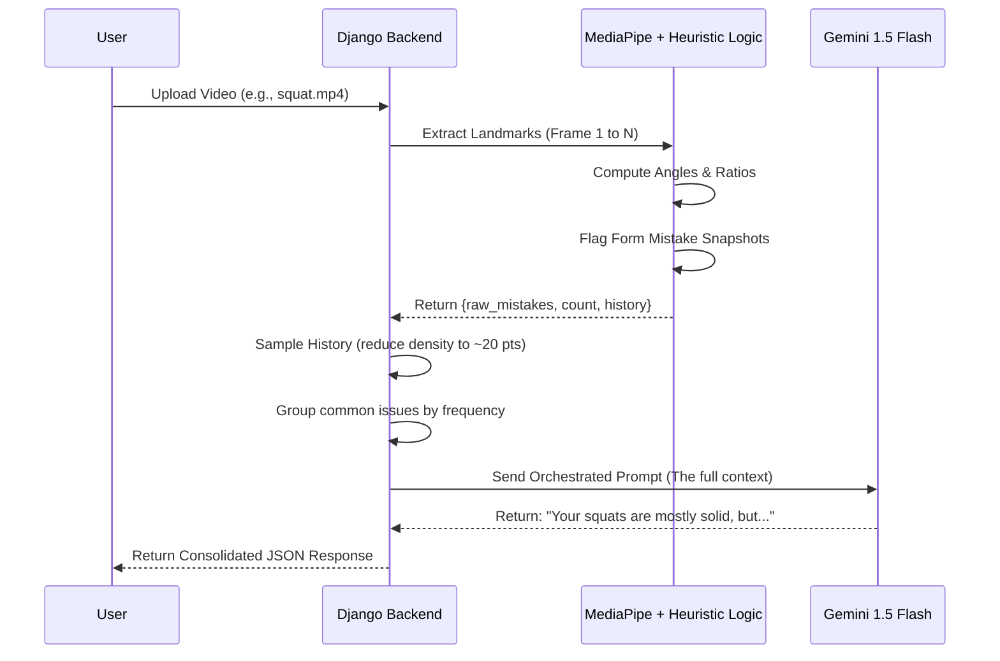

# AI Data Flow & Gemini Prompting Context

This document explains the technical "bridge" between the heuristic detection model and the Generative AI coaching layer within the PhotoRecreate analysis pipeline.

## 1. The Data Payload (Detection Output)
Before Gemini is even called, the system generates a raw dictionary of results based on heuristic analysis (calculated via MediaPipe landmarks). For a **Squat** session, the internal data structure typically looks like this:

```python
# Raw internal state passed to the prompt generator
exercise_type = "squat"
details = [
    {"stage": "knee_too_tight", "timestamp": 2},
    {"stage": "knee_too_tight", "timestamp": 5},
    {"stage": "feet_too_wide", "timestamp": 8}
]
history = [
    {"timestamp": 1, "kneeRatio": 0.82, "feetRatio": 1.45},
    # ... potentially hundreds of frames ...
    {"timestamp": 10, "kneeRatio": 0.75, "feetRatio": 1.48}
]
```

---

## 2. The Gemini Prompt (The "Send" Data)
The `generate_llm_coaching` function in `views.py` transforms the raw data above into a natural language prompt. This is the **actual string context** sent to the `gemini-1.5-flash` model:

### Example Generated Prompt String
```text
You are an experienced, encouraging personal trainer reviewing a client's exercise footage.

Exercise: Squat
Total reps with form issues: 3
Issues detected (by frequency):
  - Knee Too Tight: 2 time(s)
  - Feet Too Wide: 1 time(s)

Movement data (sampled keypoints):
[{'t': 1, 'v': 0.82}, {'t': 5, 'v': 0.78}, {'t': 10, 'v': 0.75}]

Your task:
Write ONE coaching paragraph (3–5 sentences) structured as follows:
1. Open with a brief overall read of the set — was it mostly solid, a bit shaky, or consistently off?
2. Call out the single most important form issue ("Knee Too Tight") and explain the specific RISK or missed benefit of not fixing it.
3. Give ONE concrete, immediately actionable coaching cue the athlete can apply on their very next set.
4. Close with a short motivational nudge that keeps them engaged.

Hard rules:
- Do NOT mention AI, models, or probabilities.
- Use one flowing prose paragraph only.
- Speak directly to the athlete using "you" and "your".
```

---

## 3. High-Level Pipeline Flow
The following diagram illustrates the lifecycle of a single analysis request:



---

## 4. The Final App Response (The "Result" JSON)
This is the structured data returned to the Swift client (e.g., your iOS app). It contains both the "mechanical" detection data and the "human" AI feedback:

```json
{
  "processed": true,
  "file_name": "video_20260423.mp4",
  "mistake_count": 3,
  "details": [
    {
      "stage": "knee_too_tight",
      "timestamp": 2,
      "explanation": "Your knees tracked too far inside the ideal squat line. Drive them out over your toes.",
      "frame": "http://.../static/images/frame_123.jpg"
    }
  ],
  "llm_feedback": "Your squat set shows a great baseline of strength, but we need to focus on your knee alignment. By letting your knees cave inward, you're losing stability and putting unnecessary stress on the joints. On your next set, focus on driving your knees outward so they stay directly over your toes. You're moving well—just tune up that one alignment cue and you'll be unstoppable!",
  "counter": { "single": 5 }
}
```

---

### Key Technical Details:
- **Sampling**: `history` is sampled (using `max(1, len(history) // 20)`) to provide the AI with the *trend* of movement without overwhelming the context window.
- **Normalization**: `normalize_feedback_details` ensures that a high-level UI component can display mistakes regardless of whether it was a squat, lunge, or plank.
- **Rules**: The Gemini prompt includes "Hard Rules" to ensure it never reveals its technical identity, maintaining the illusion of a human coach.
